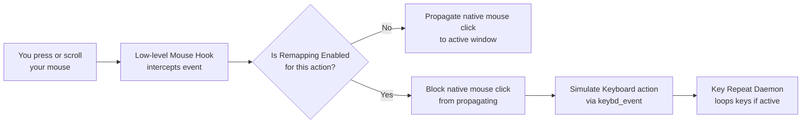
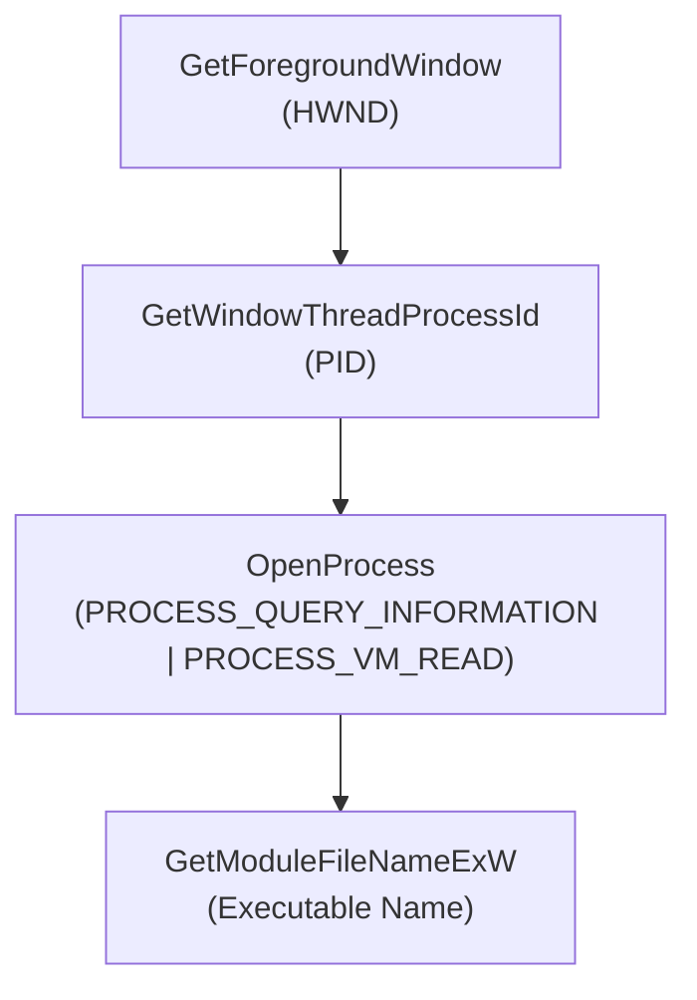

# MouseX: Absolute Mouse Control — User Guide

> **MouseX** is a local-first, low-level Windows keyboard/mouse remapping application. It sits in your system tray and monitors mouse actions system-wide. When a mouse event occurs, MouseX intercepts it at the Win32 kernel level, blocks the default action, and simulates custom keyboard shortcuts, chords, or rapid repeating loops—all customized to whatever application currently has your desktop focus.

---

## Table of Contents

1. [How It Works — The Big Picture](#how-it-works--the-big-picture)
2. [Application Walkthrough](#application-walkthrough)
3. [Full Pathway #1 — Mouse Button Remapping](#full-pathway-1--mouse-button-remapping)
4. [Full Pathway #2 — Dynamic Profile Switching](#full-pathway-2--dynamic-profile-switching)
5. [Full Pathway #3 — Key Repeat Loop Thread](#full-pathway-3--key-repeat-loop-thread)
6. [Example 1 — Mapping Shift to Mouse Button 4](#example-1--mapping-shift-to-mouse-button-4)
7. [Example 2 — Cyclic Tab Browser Scrolling](#example-2--cyclic-tab-browser-scrolling)
8. [Example 3 — Chord Hotkey Simulation](#example-3--chord-hotkey-simulation)
9. [Example 4 — Repeating Keystroke Loop](#example-4--repeating-keystroke-loop)
10. [Example 5 — Application Profile Creation](#example-5--application-profile-creation)
11. [UI Guide — Dashboard](#ui-guide--dashboard)
12. [UI Guide — Sliding Toggle CSS](#ui-guide--sliding-toggle-css)
13. [System Tray Integration](#system-tray-integration)
14. [HookManager — The Win32 Hook Pipeline](#hookmanager--the-win32-hook-pipeline)
15. [Active Window Monitor Details](#active-window-monitor-details)
16. [Autostart Registry Management](#autostart-registry-management)
17. [Troubleshooting](#troubleshooting)
18. [Packaging & Launch4j Execution](#packaging--launch4j-execution)
19. [Project Summary](#project-summary)

---

## How It Works — The Big Picture



<details>
<summary>ASCII fallback (click to expand)</summary>

```
┌──────────────┐     ┌──────────────┐     ┌──────────────────┐     ┌──────────────┐     ┌────────────────┐
│  You click   │────►│ Low-level    │────►│  Is remap active │────►│  YES: Block  │────►│ Simulate       │
│  or scroll   │     │ mouse hook   │     │  for this button?│     │  native mouse│     │ keyboard event │
│  your mouse  │     │ intercepts   │     └────────┬─────────┘     │  event       │     │ (keybd_event)  │
└──────────────┘     └──────────────┘              │               └──────────────┘     └───────┬────────┘
                                                   │                                            │
                                          ┌────────┴─────────┐                         ┌────────▼────────┐
                                          │  NO: Pass native │                         │ Run repeat loop │
                                          │  mouse event down│                         │ if configured   │
                                          └──────────────────┘                         └─────────────────┘
```

</details>

**In plain English:**

1. **You trigger a mouse event** — This includes Left Click, Right Click, Middle Click, X1 (Back), X2 (Forward), or Scroll Wheel Up/Down.
2. **MouseX intercepts it** — The native hook intercepts the Windows message before it is processed by the target window.
3. **Evaluation** — If the button is configured for remapping in the active profile, MouseX blocks the default mouse action (`return new LRESULT(1)`).
4. **Keystroke Simulation** — JNA calls Windows `keybd_event` to simulate virtual keyboard inputs. Mappings can execute up to 3 keys simultaneously as a chord (e.g. `Ctrl+C`) or sequentially.
5. **Key Repeating** — If repeat is enabled, a background daemon thread continuously triggers the keystrokes at your configured speed (10ms–1000ms) until released or toggled.

---

## Application Walkthrough

### Starting MouseX

When you run MouseX (`App.java` or `MouseX.exe`), the following lifecycle occurs:

1. **Implicit Exit Configuration** — `Platform.setImplicitExit(false)` is set to keep the JavaFX application alive when the GUI window is closed.
2. **Profiles Loading** — `ConfigManager` loads profiles from `profiles.json`. If it doesn't exist, it checks for an old `config.json` configuration and migrates it to the default profile.
3. **GUI Setup** — The JavaFX Stage is initialized with a stylesheet (`styles.css`) and sized to 55% of the primary screen width.
4. **System Tray Integration** — If supported by the OS, a system tray icon (`MouseX.png`) and popup menu are created.
5. **Background Monitor Start** — The `ActiveWindowMonitor` thread is started to check foreground application focus every 500 milliseconds.
6. **Hook Activation** — When you click **START HOOK**, `HookManager` starts a daemon thread (`MouseHookThread`) which registers the Windows `WH_MOUSE_LL` hook and enters a Win32 message loop to keep the hook pump running.

### Minimizing and Exiting

- **Close Dashboard Window** — Hides the window from the taskbar, keeping the application active in the tray.
- **Double-click Tray Icon** — Re-opens and focuses the JavaFX GUI dashboard.
- **Right-click Tray -> Exit** — Stops the mouse hook, removes the tray icon, closes threads, and calls `System.exit(0)`.

---

## Full Pathway #1 — Mouse Button Remapping

### Step 1: Physical Click Interception
You click Mouse Button 4 (X1 / Back). The Windows OS creates a low-level mouse input event. JNA intercepts this in the Standard Call Callback hook proc:
- `w` matches `0x020B` (`WM_XBUTTONDOWN`).
- Mouse extra data extracts the high-word flags to resolve that it is indeed Button 4.

### Step 2: Config Verification
`HookManager` queries its synchronized remapping configuration:
- Button 4 -> `isRemapped = true`
- Keys mapped: `17` (`Ctrl`), `67` (`C`)
- Chord: `true`

### Step 3: Event Block
The callback returns `new LRESULT(1)` instead of calling `CallNextHookEx`. This prevents Windows from forwarding the "Back" event to your browser or folder view, preventing accidental navigation.

### Step 4: Key Event Generation
Because `isChord` is true, MouseX executes the simulated keys together:
1. Presses `Ctrl` (`keybd_event(0x11, 0, 0, 0)`)
2. Presses `C` (`keybd_event(0x43, 0, 0, 0)`)
3. Releases `Ctrl` (`keybd_event(0x11, 0, 2, 0)`)
4. Releases `C` (`keybd_event(0x43, 0, 2, 0)`)

---

## Full Pathway #2 — Dynamic Profile Switching

### Step 1: Active Window Monitoring
The `ActiveWindowMonitor` thread runs continuously in the background:
```java
HWND hwnd = User32.INSTANCE.GetForegroundWindow();
```

### Step 2: Process Resolution
The monitor resolves the executable name of the active window:
1. Gets the thread and process ID (`GetWindowThreadProcessId`).
2. Opens the process handles (`OpenProcess` with read rights).
3. Parses the module path name (`GetModuleFileNameExW`).
4. Extracts the lowercase filename (e.g. `chrome.exe`).

### Step 3: Switch Profile
- If `chrome.exe` is in `allProfiles`, target profile is set to `chrome.exe`. Otherwise, it falls back to `Default`.
- If the target profile is different from `activeProfileName`, it switches the active configuration mappings in `HookManager`.
- Runs `Platform.runLater()` to refresh all dashboard toggles and slots visible in the JavaFX UI.

---

## Full Pathway #3 — Key Repeat Loop Thread

### Step 1: Toggle or Hold Detection
When a button is pressed and `repeatEnabled` is active:
- **Hold mode** (`repeatUntilClick = false`):
  - On Mouse Down, `repeatActive[btnIdx]` is set to `true`.
  - On Mouse Up (`WM_XBUTTONUP`), `repeatActive[btnIdx]` is set to `false`.
- **Toggle mode** (`repeatUntilClick = true`):
  - On Mouse Down, the state of `repeatActive[btnIdx]` is toggled. If it becomes `true`, the loop starts. If it becomes `false`, the loop stops. Mouse Up events are ignored.

### Step 2: Thread Execution
If `repeatActive[btnIdx]` resolves to `true`, a daemon thread is created:
```java
Thread repeatThread = new Thread(() -> {
    while (repeatActive[btnIdx].get() && hookActive) {
        simulateKey(buttonToRepeat);
        Thread.sleep(interval);
    }
});
```
This loop generates simulated keyboard events at the precise millisecond interval specified by the user.

---

## Example 1 — Mapping Shift to Mouse Button 4

Let's configure Mouse Button 4 to act as the Shift key:

| Step | Configuration |
|---|---|
| Target Card | **Mouse Button 4 (X1 / Back)** |
| Slot Configuration | Enable `Slot 1` -> Select `Shift` |
| Options | Check `Enable remap` |
| Output JSON | `"4": { "keys": [16], "remap": true, "repeat": false }` |

---

## Example 2 — Cyclic Tab Browser Scrolling

Remap the scroll wheel in web browsers to navigate tabs (`Tab` / `Shift+Tab`):

| Scroll Up (Btn 6) | Scroll Down (Btn 7) |
|---|---|
| Enable `Slot 1` -> Select `Tab` | Enable `Slot 1` -> `Shift`, `Slot 2` -> `Tab` |
| Check `Enable remap` | Check `Enable remap`, Check `As Chord` |
| Result: Switches tab forward | Result: Switches tab backward |

---

## Example 3 — Chord Hotkey Simulation

Map Middle Click to open the Task Manager shortcut (`Ctrl+Shift+Esc`):

| Option | Setting |
|---|---|
| Target Card | **Mouse Button 3 (Middle Click)** |
| Slots | `Slot 1` -> `Ctrl`, `Slot 2` -> `Shift`, `Slot 3` -> `Esc` |
| Flags | Check `Enable remap`, Check `As Chord` |
| Result | Clicking the mouse wheel fires `Ctrl+Shift+Esc` instantly |

---

## Example 4 — Repeating Keystroke Loop

Simulate clicking space bar 20 times a second (50ms interval) to jump in a game:

| Option | Setting |
|---|---|
| Target Card | **Mouse Button 5 (X2 / Forward)** |
| Slots | `Slot 1` -> `Space` |
| Flags | Check `Enable remap`, Check `Enable repeat` |
| Slider | Set to `50ms` |
| Result | Holding Button 5 triggers Spacebar every 50ms |

---

## Example 5 — Application Profile Creation

Add a custom layout mapping specifically for Chrome:

1. Open Chrome.
2. In the MouseX dashboard header, click **`+`**.
3. A dialog appears listing running executables. Select `chrome.exe` and confirm.
4. Customize your remapping configurations for the `chrome.exe` profile.
5. Save your profile preset. The profile will now activate only when Chrome is focused.

---

## UI Guide — Dashboard

The JavaFX interface is built on a VBox layout with three main sections:

### 1. Header Control Bar
- **App Title**: Large, styled `MOUSEX` title with subtext `ABSOLUTE MOUSE CONTROL` in bold grey.
- **Profile Selector**: Combobox displaying loaded profiles.
- **Add Profile Button (`+`)**: Scans foreground processes to add custom application targets.
- **Autostart Checkbox**: Enables/disables autostart on boot.

### 2. Scrollable Mappings Grid
A scroll pane displaying cards for the 7 remapping channels:
- Custom remapping slots (1 to 3 dropdown selectors).
- Status toggles (`Enable remap`, `As Chord`, `Enable repeat`, `Repeat until click`).
- Precision interval slider showing delay text in milliseconds.

### 3. Footer Control Panel
- **Status Box**: Displays connection state using a circular shape and dropshadow glows (Red = stopped, Green = running).
- **Control Buttons**: Shaded buttons to **Load Preset**, **Save Preset**, and **START HOOK** / **STOP HOOK**.

---

## UI Guide — Sliding Toggle CSS

All standard checkboxes in the application are customized in `styles.css` to render as modern physical sliding toggle switches.

- **Toggle Track** (`.check-box > .box`): Styled with transparent dark borders, round corners, and background-color changes upon selection:
  ```css
  .check-box:selected > .box {
      -fx-background-color: rgba(139, 92, 246, 0.2);
      -fx-border-color: #8B5CF6;
  }
  ```
- **Toggle Thumb** (`.check-box > .box > .mark`): Styled as a circular dot with translation animations (sliding horizontally):
  ```css
  .check-box > .box > .mark {
      -fx-shape: "M0 6 A6 6 0 1 1 12 6 A6 6 0 1 1 0 6 Z"; /* Circle path */
      -fx-translate-x: -7px; /* Inactive: left side */
  }
  .check-box:selected > .box > .mark {
      -fx-translate-x: 7px; /* Active: right side */
  }
  ```

---

## System Tray Integration

If `SystemTray.isSupported()` is true:
- An instance of `java.awt.SystemTray` is created.
- A popup menu is built containing:
  - **Open Dashboard**: Restores and focuses the primary stage.
  - **Toggle Hook**: Starts or stops key interceptors.
  - **Exit**: Unhooks listeners and shuts down the app.
- A double-click listener is registered on `TrayIcon` to easily restore the window.

---

## HookManager — The Win32 Hook Pipeline

The low-level hook implementation uses Java Native Access to map standard Win32 variables and hooks:

```java
public HHOOK SetWindowsHookEx(int idHook, MyHOOKPROC lpfn, HMODULE hmod, int dwThreadId);
```

### Thread Message Loop
A message pump is required to dispatch events to low-level Windows hooks:
```java
WinUser.MSG msg = new WinUser.MSG();
while (hookActive) {
    int result = MyUser32.INSTANCE.GetMessage(msg, null, 0, 0);
    if (result <= 0) break;
    MyUser32.INSTANCE.TranslateMessage(msg);
    MyUser32.INSTANCE.DispatchMessage(msg);
}
```

### Event Structs
JNA uses a custom `Structure` representing the `MSLLHOOKSTRUCT` layout in memory:

| Field | Type | Description |
|---|---|---|
| `pt` | `POINT` | Cursor coordinates |
| `mouseData` | `int` | High-order word contains wheel delta or Xbutton flags |
| `flags` | `int` | Event-injected flags |
| `time` | `int` | Event timestamp |
| `dwExtraInfo` | `ULONG_PTR` | Extra info associated with the event |

---

## Active Window Monitor Details

Focus checking uses JNA to monitor foreground actions every 500ms:



This prevents system slowdowns by avoiding complex hooks, querying process metadata directly.

---

## Autostart Registry Management

Windows Registry auto-launch paths are set via JNA's `Advapi32Util`:

- **Path**: `HKEY_CURRENT_USER\Software\Microsoft\Windows\CurrentVersion\Run`
- **Key**: `MouseRemapper`
- **Command Value**:
  - Packaging JAR: `javaw -jar "path\to\mousex-1.0.0.jar"`
  - Development Target: `java -cp "classpath" com.mouseremapper.App`

---

## Troubleshooting

### Native Hook Fails to Start
- **Cause**: Standard user accounts are occasionally blocked from hooking low-level events if target windows run as Administrator.
- **Fix**: Run MouseX as Administrator.

### Key Repeating Lag
- **Cause**: Low intervals (e.g. 10ms) might flood the operating system message queue.
- **Fix**: Increase the repeat interval using the slider, or disable chords for rapid-fire keys.

### Tray Icon Doesn't Load
- **Cause**: Desktop environments without standard system trays (or running in certain virtual machines).
- **Fix**: Click standard close buttons; the application will fall back to hiding the stage.

---

## Packaging & Launch4j Execution

To distribute MouseX as a standalone binary:

1. **Build shaded JAR**:
   ```powershell
   mvn package
   ```
   This packages all dependencies (including JNA libraries and GSON) into a single shaded JAR file.

2. **Launch4j Configuration**:
   The `MouseX.xml` configuration defines:
   - Outfile: `MouseX.exe`
   - Classpath / Shaded JAR: `target/mousex-1.0.0.jar`
   - Header type: `gui` (forces headless runtime, suppressing cmd windows)
   - Runtime dependencies: Path parameters lookup `%JAVA_HOME%` to load the appropriate runtime JVM.

---

## Project Summary

| Class | Description |
|---|---|
| `Main` | Shaded executable entry wrapper that calls `App.main` |
| `App` | JavaFX GUI components, profile comboboxes, active window thread, system tray menu |
| `HookManager` | Win32 mouse hook thread, callback processors, keyboard simulation |
| `ConfigManager` | Serialization helper; saves and loads user mapping configurations |
| `Autostart` | Registry management; registers/unregisters application boot commands |
| `styles.css` | Custom dark-violet stylesheets and sliding toggle switches |

---

*MouseX: Absolute Mouse Control v1.0 — Built with JavaFX + JNA Low-Level Hooks*
