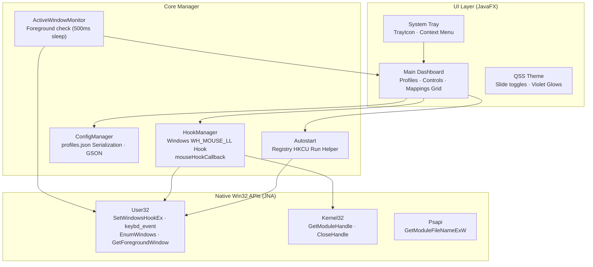
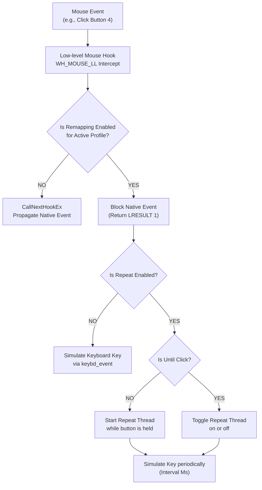

<p align="center">
  
</p>
<h1 align="center">MouseX: Absolute Mouse Control</h1>
<p align="center">
  <strong>Global mouse input remapping utility with application-specific profiling and autostart on Windows</strong><br/>
  <em>Intercept mouse events at a system level → simulate keyboard hotkeys and actions — all offline</em>
</p>

<p align="center">
  
  
  
  
  
</p>

---

## 📋 Table of Contents

- [Overview](#-overview)
- [Why MouseX?](#-why-mousex)
- [Features](#-features)
- [Architecture](#-architecture)
- [Pipeline Flow](#-pipeline-flow)
- [Quick Start](#-quick-start)
- [Build Standalone EXE](#-build-standalone-exe)
- [Project Structure](#-project-structure)
- [Dependencies](#-dependencies)
- [Configuration](#-configuration)
- [Roadmap](#-roadmap)
- [Author](#-author)

---

## 🔍 Overview

**MouseX** is a native Windows desktop utility built in Java 21 and JavaFX that lets you remap your mouse clicks, scrolls, and extra buttons to simulated keyboard inputs. By utilizing a low-level global Windows hook (`WH_MOUSE_LL`) via Java Native Access (JNA), MouseX intercepts mouse messages at the system level and routes them to virtual keyboard events, enabling mouse-driven shortcuts, rapid key-repeating macros, and complex chord combinations.

MouseX features an intelligent, background window-monitoring engine that dynamically switches mapping profiles based on whichever application currently has foreground focus. With system tray minimization and registry-based autostart integration, it is designed to run silently and efficiently in the background.

---

## 🎯 Why MouseX?

> **Standard mouse configuration software is often bloated, requires constant internet access, or lacks advanced key repeating options. MouseX is a lightweight, local-first remapper.**

| | Standard Driver Software | MouseX |
|---|---|---|
| **Resource Usage** | High memory usage, background updater processes | Minimal footprint (~60 MB JVM), single-threaded hook pump |
| **Chords & Sequences** | Limited to simple macros or single keys | Map up to 3 keys per mouse action as simultaneous chords or sequences |
| **Repeating Options** | Basic repeat while held | Custom sliders (10ms-1000ms), repeat while held, or toggle repeat on click |
| **App Integration** | Manual profile switching or heavy background scanner | Lightweight win32 API monitoring thread checks active processes directly |
| **Autostart** | Custom background services | Native Windows HKEY_CURRENT_USER Run registry integration |

---

## ✨ Features

### 🖱️ Mouse Event Remapping
| Feature | Description |
|---|---|
| **7 Action Channels** | Map Left Click (Btn 1), Right Click (Btn 2), Middle Click (Btn 3), X1/Back (Btn 4), X2/Forward (Btn 5), Wheel Up (Btn 6), Wheel Down (Btn 7) |
| **Event Blocking** | When a button is remapped, its native click or scroll message is completely blocked from propagating to other apps |
| **Multi-Slot Keys** | Configure up to 3 keyboard keys to be fired from a single mouse event |
| **Keyboard Chords** | Run keys as a chord (simultaneously pressed down and released together, e.g., `Ctrl+Shift+S`) or sequentially |

### ⚡ Key Simulation & Repeating
| Feature | Description |
|---|---|
| **JNA Keyboard Event** | Simulates keypresses using Windows `keybd_event` API for absolute compatibility with games and desktop software |
| **Repeat While Held** | Continually repeat key triggers while holding down the mouse button |
| **Toggle Repeat** | "Repeat until click" toggles a repeating loop on the first click, and stops it on the second click |
| **Interval Sliders** | Precision delay configuration from 10 milliseconds up to 1000 milliseconds for repeating keys |

### 🗂️ App-Specific Profiling
| Feature | Description |
|---|---|
| **Foreground Switcher** | Periodically checks foreground process names via Win32 `GetForegroundWindow` and automatically applies the matching profile |
| **Auto Discovery** | Click `+` to scan currently running visible applications and generate a profile matching their executable name |
| **Default Fallback** | Reverts to the "Default" profile when focusing on unmapped software or the desktop |
| **JSON Profiles** | Save and load all mappings in a structured `profiles.json` layout |

### 📦 System Tray & Autostart
| Feature | Description |
|---|---|
| **Tray Minimization** | Minimizes to system tray on close request, keeping the active mouse hooks running in the background |
| **Registry Autostart** | Registers a startup command in Windows Registry (`Software\Microsoft\Windows\CurrentVersion\Run`) using `javaw -jar` |
| **Tray Context Menu** | Right-click tray icon to open dashboard, toggle hook, or exit the program |

### 🎨 Premium User Interface
| Feature | Description |
|---|---|
| **Custom Toggle CSS** | Beautiful physical sliding toggle switches for checkboxes styled entirely with custom QSS rules |
| **Status Indicators** | Real-time status dot with glow effect (Red = stopped, Green = running hook active) |
| **Responsive Grid** | Layout automatically fits all 7 cards with scroll panes and scales based on screen bounds |

---

## 🏗 Architecture



<details>
<summary>ASCII fallback (click to expand)</summary>

```
┌──────────────────────────────────────────────────────────────────────┐
│                            MouseX Utility                            │
│                                                                      │
│  ┌────────────────────────────────────────────────────────────────┐  │
│  │                     UI Layer (JavaFX 21)                       │  │
│  │                                                                │  │
│  │  ┌──────────────┐      ┌─────────────────────┐                 │  │
│  │  │ Main         │      │ System Tray         │                 │  │
│  │  │ Dashboard    │◄────►│ TrayIcon, menu      │                 │  │
│  │  └──────┬───────┘      └─────────────────────┘                 │  │
│  └─────────┼──────────────────────────────────────────────────────┘  │
│            │                                                         │
│  ┌─────────▼──────────────────────────────────────────────────────┐  │
│  │                     Core Manager                               │  │
│  │                                                                │  │
│  │  ┌──────────────┐      ┌─────────────────────┐                 │  │
│  │  │ HookManager  │      │ ActiveWindowMonitor │                 │  │
│  │  │ mouse hook   │◄────►│ Thread (500ms check)│                 │  │
│  │  └──────┬───────┘      └──────────┬──────────┘                 │  │
│  │         │                         │                            │  │
│  │  ┌──────▼───────┐      ┌──────────▼──────────┐                 │  │
│  │  │ ConfigManager│      │ Autostart Registry  │                 │  │
│  │  │ profiles.json│      │ Helper              │                 │  │
│  │  └──────────────┘      └──────────┬──────────┘                 │  │
│  └───────────────────────────────────┼────────────────────────────┘  │
│                                      │                               │
│  ┌───────────────────────────────────▼────────────────────────────┐  │
│  │                     Native Win32 APIs (JNA)                    │  │
│  │                                                                │  │
│  │  ┌──────────────────────────────────────────────────────────┐  │  │
│  │  │ User32.dll                                               │  │  │
│  │  │ SetWindowsHookEx · keybd_event · GetForegroundWindow     │  │  │
│  │  └──────────────────────────────────────────────────────────┘  │  │
│  │  ┌───────────────────────────┐    ┌─────────────────────────┐  │  │
│  │  │ Kernel32.dll              │    │ Psapi.dll               │  │  │
│  │  │ GetModuleHandle           │    │ GetModuleFileNameExW    │  │  │
│  │  └───────────────────────────┘    └─────────────────────────┘  │  │
│  └────────────────────────────────────────────────────────────────┘  │
└──────────────────────────────────────────────────────────────────────┘
```

</details>

---

## 🔄 Pipeline Flow



<details>
<summary>ASCII fallback (click to expand)</summary>

```
Mouse Action (Btn 1-5, Scroll 6-7)
     │
     ▼
Low-level Mouse Hook Intercept (WH_MOUSE_LL)
     │
     ├────────────────► Is Remap Enabled for Current Active Profile?
     │                       │
     │                 ┌─────┴─────┐
     │                 │ NO        │ → CallNextHookEx (Normal Propagation)
     │                 │ YES       │ → Block Native Event (Return 1) ↓
     │                 └───────────┘
     ▼
Block Event & Evaluate Key Configuration
     │
     ├────────────────► Is Repeating Enabled?
     │                       │
     │                 ┌─────┴─────┐
     │                 │ NO        │ → Simulate Key(s) immediately (keybd_event)
     │                 │ YES       │ → Check Repeat Mode ↓
     │                 └───────────┘
     ▼
Repeat Configuration Check
     │
     ├────────────────► Is "Repeat Until Click" Toggle Mode?
     │                       │
     │                 ┌─────┴─────┐
     │                 │ NO        │ → Launch daemon thread; repeat key on interval;
     │                 │           │   stop on MouseButtonUp event
     │                 │ YES       │ → Toggle repeat thread state (start if idle,
     │                 │           │   terminate if already running)
     │                 └───────────┘
     ▼
Simulate keypresses with JNA keybd_event (support chords or sequence lists)
```

</details>

---

## 🚀 Quick Start

### Option A — Download Pre-compiled Binary (Recommended)

If you don't want to build from source, you can download `MouseX.exe` (v1.0.0) directly from the [GitHub Releases](https://github.com/Felix-au/MouseX-Absolute-Mouse-Control/releases) page and run it immediately on Windows.

### Option B — Build and Run from Source

#### Prerequisites

- **Windows 10 or 11** (64-bit recommended)
- **JDK 21 or higher**
- **Maven 3.8+**

#### Install & Run

1. **Clone the repository:**
   ```powershell
   git clone https://github.com/Felix-au/MouseX-Absolute-Mouse-Control.git
   cd MouseX-Absolute-Mouse-Control
   ```

2. **Build the project using Maven:**
   ```powershell
   mvn clean package
   ```
   This compiles the source code, matches dependencies, and outputs a shaded JAR file: `target/mousex-1.0.0.jar`

3. **Run the utility:**
   ```powershell
   mvn javafx:run
   ```

On launch:
- The dashboard window displays with all 7 configuration panels.
- Status is shown as **Stopped** (Red indicator).
- Select keys and check **Enable remap** on any card.
- Click **START HOOK** to begin remapping.

---

## 📦 Build Standalone EXE

You can package the application into a native Windows executable (`MouseX.exe`) using **Launch4j**:

1. Ensure the project is packaged:
   ```powershell
   mvn package
   ```
2. Open Launch4j and load `MouseX.xml` configuration, or build via command line:
   ```powershell
   launch4jc MouseX.xml
   ```
3. The executable `MouseX.exe` is generated in the root directory.

---

## 📁 Project Structure

```
MouseX-Absolute-Mouse-Control/
├── pom.xml                      # Maven build profile & dependencies
├── dependency-reduced-pom.xml   # Shaded POM output
├── MouseX.xml                   # Launch4j executable configuration
├── MouseX.exe                   # Wrapped native GUI binary (build output)
├── profiles.json                # User settings (keys, toggles, profile maps)
├── LICENSE                      # MIT License
├── .gitignore                   # Ignore target/ output, logs, local JSONs
│
└── src/
    └── main/
        ├── java/
        │   └── com/
        │       └── mouseremapper/
        │           ├── Main.java         # Static main wrapper for packaging
        │           ├── App.java          # JavaFX Controller and layout manager
        │           ├── Autostart.java    # JNA Win32 startup registry manager
        │           ├── ConfigManager.java# GSON-based profiles serializer
        │           └── HookManager.java  # JNA WH_MOUSE_LL hook and keyboard simulator
        │
        └── resources/
            ├── MouseX.png                # Window and dashboard logo
            ├── MouseX.ico                # System tray icon file
            └── com/
                └── mouseremapper/
                    └── styles.css        # QSS custom stylesheets
```

---

## 📚 Dependencies

| Package | Purpose | Version |
|---|---|---|
| `javafx-controls` | JavaFX core window components | 21.0.2 |
| `javafx-graphics` | JavaFX layout, images, styling | 21.0.2 |
| `jna` | Java Native Access library | 5.14.0 |
| `jna-platform` | Predefined Windows API platforms (Advapi32, User32, Psapi) | 5.14.0 |
| `gson` | JSON serialization tool | 2.10.1 |

---

## ⚙️ Configuration

Profiles are automatically saved to `profiles.json` in the working directory:

```json
{
  "Default": {
    "4": {
      "keys": [16, 65],
      "remap": true,
      "repeat": false,
      "untilClick": false,
      "repeatIntervalMs": 100,
      "isChord": true
    }
  },
  "chrome.exe": {
    "6": {
      "keys": [9],
      "remap": true,
      "repeat": false,
      "untilClick": false,
      "repeatIntervalMs": 100,
      "isChord": false
    }
  }
}
```

### Profile Properties
- `keys`: Virtual key codes array (e.g. `16` = Shift, `65` = A).
- `remap`: Toggle to enable/disable remapping for this key.
- `repeat`: Repeat key simulation at specified intervals.
- `untilClick`: Toggle repeat loop on first click; stop on subsequent clicks.
- `repeatIntervalMs`: Interval between simulated key events in milliseconds.
- `isChord`: Simulate keys simultaneously (`true`) or sequentially (`false`).

---

## 👤 Author

**Felix-au** (Harshit Soni)

- 🔗 GitHub: [github.com/Felix-au](https://github.com/Felix-au)
- 📧 Email: [harshit.soni.23cse@bmu.edu.in](mailto:harshit.soni.23cse@bmu.edu.in)

---

<p align="center">
  <sub>Built for users who want absolute mouse control without the bloat.</sub>
</p>